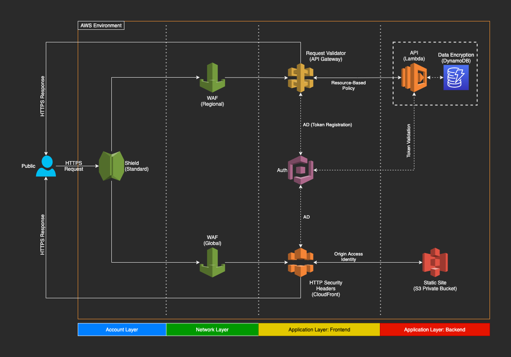

# aws-api-security-demo

Security implementations demonstrator for APIs created using AWS API Gateway and Lambda, deployed with Terraform.

---

## Overview

Deploy a test API in AWS using the included Terraform configuration files and Lambda source codes (Python3). The Lambda function returns the event details from API Gateway. You will need a working Terraform account and installation. For easier setup, you can use Terraform Cloud.

> **CHARGES MAY APPLY**

The main purpose of this demonstrator is to show the different security compoments implemented to protect an API in the AWS environment. After deployment is complete, you can test the API with different inputs, enable / disable each security component, and see how each change affects the results.

### Infrastructure Diagram



## Prerequisites

1. An AWS account and the know-how to navigate within it.

2. Some familiarity with the command line (BASH, Powershell, etc.).

3. (Optional) Some familiarity with Python3.

## Caveat

1. The API Gateway configuration in this deployment currently does not have a CORS setting, so trying to hit the endpoint using a web browser and some API testing tools like Postman and even Swagger may fail. You can add it manually after deployment in the [API Gateway](https://console.aws.amazon.com/apigateway/) console if you like.

2. There is no database backend in this demonstrator. You can deploy one in your AWS account if you like to test data encryption-at-rest, and how it's related to AWS Key Management Service (KMS).

## Components

1. Shield DDoS protection (available by default, not part of this deployment)

2. Web Application Firewall (WAF)

3. API Gateway Request Validator

4. Python input validators

## Files

1. [aws.tf](backend.tf) - Cloud provider details (the one included here is for AWS)

2. [variables.tf](locals.tf) - User variable definitions.

3. [main.tf](main.tf) - Main definitions for resources and outputs.

4. [modules/lambda.tf](modules/lambda.tf) - Lambda function and role definitions.

5. [modules/waf_regional.tf](modules/waf_regional.tf) - WAF WebACL definition.

6. [resources/lambda_function.py](resources/lambda_function.py) - Python3 code for the backend Lambda function (will need to be ZIPped as *lambda_function.zip*)

## Deployment

Deploy with the standard *terraform apply* command once you've setup and initialized Terraform. The script will output the API endpoint, but you will need to obtain the API key from either the [API Gateway](https://console.aws.amazon.com/apigateway/) or [Lambda](https://console.aws.amazon.com/lambda/) console.

## Usage

1. Full [API documentation](https://www.warpedlenses.com/swagger/security.html)

2. Quickstarts

    - In BASH

        ```bash
        curl \
            -X POST \
            '<endpoint>?code=<arbitrary>' \
            -H 'content-type: application/json' \
            -H 'x-api-key: <API key>' \
            -d '{"myname": "<arbitrary>"}'
        ```

    - In Python3

        ```python
        import requests

        response = requests.post(
            '<endpoint>?code=<arbitrary>',
            headers={
                'content-type': 'application/json',
                'x-api-key': '<API key>'
            },
            data='{"myname": "<arbitrary>"}'
        )

        print(response.text)
        ```

## Tests

Here are some basic tests you can do to see how the different components work.

1. The WAF rules block the "**://**" pattern from query string parameters to protect against inclusions. You can try using something like "**?code=12345**" vs. "**?code=http://12345**" while the WAF is enabled and disabled in the [API Gateway](https://console.aws.amazon.com/apigateway/) console (in the *Stage* configuration) to see the difference.

    > Remember to redeploy the API after making changes in the console. It may take a few minutes for the changes to take effect after redeployment.

2. The API Gateway Request Validator checks for the existence of the following

    - *content-type* header
    - *x-api-key* header
    - *code* query string parameter
    - *myname* request body parameter (and nothing else in the body)

    You can try the request with and without those elements (and even some extra elements in the case of the request body).

3. The Lambda Python input validators check for the following

    - The *content-type* header value is *application/json*
    - The *code* parameter value consists only of numbers
    - The *myname* parameter value consists only of alphanumeric characters and underscores
    - All of the aforementioned parameters exist

    You can try the request with different types of values and characters to see the different responses. You can also remove the validators (*assert* statements) to let special characters through.
